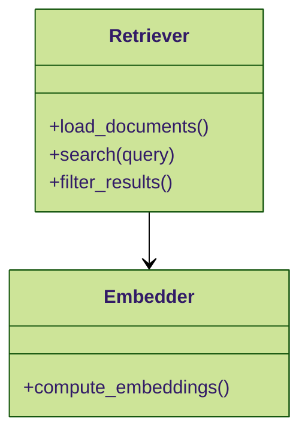

# Code Diagram (Retriever Module)

```mermaid
%%{init: {'theme': 'forest'}}%%
classDiagram
    class Retriever {
        +load_documents()
        +search(query)
        +filter_results()
    }

    class Embedder {
        +compute_embeddings()
    }

    Retriever --> Embedder
```
