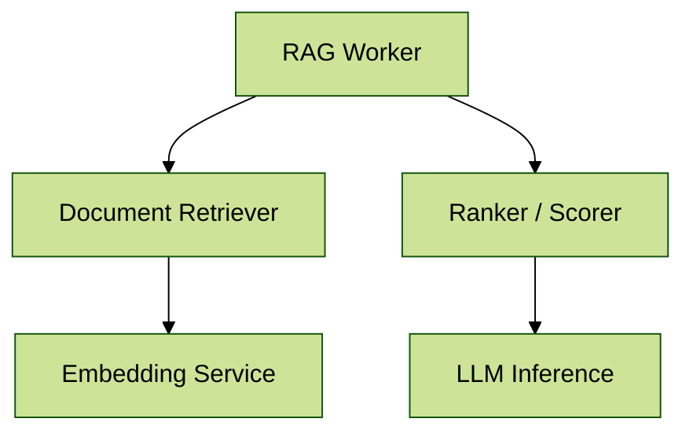

# Components Diagram (RAG Worker)

```mermaid
%%{init: {'theme': 'forest'}}%%
graph TD
    Worker[RAG Worker]
    Retriever[Document Retriever]
    Ranker[Ranker / Scorer]
    Embedder[Embedding Service]
    LLM[LLM Inference]

    Worker --> Retriever
    Worker --> Ranker
    Retriever --> Embedder
    Ranker --> LLM
```
