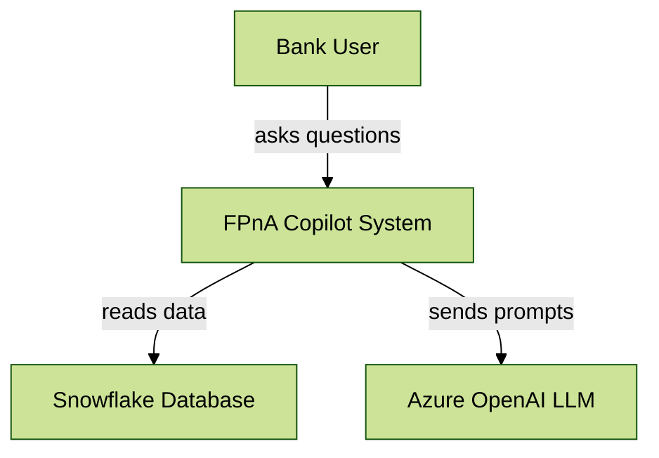

# Context Diagram

```mermaid
%%{init: {'theme': 'forest'}}%%
graph TB
    User[Bank User]
    FPnA[FPnA Copilot System]
    LLM[Azure OpenAI LLM]
    DB[Snowflake Database]

    User -->|asks questions| FPnA
    FPnA -->|reads data| DB
    FPnA -->|sends prompts| LLM
```
