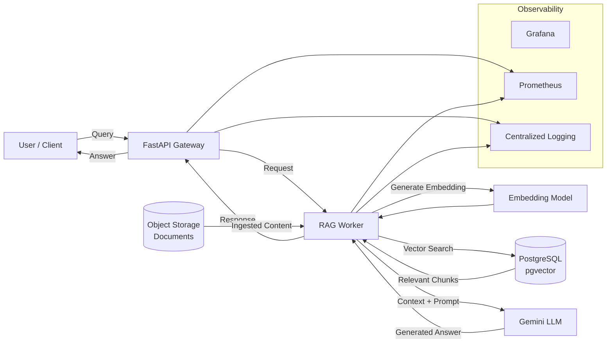

```mermaid
flowchart LR
    User[User / Client] -->|Query| API[FastAPI Gateway]

    API -->|Request| RAG[RAG Worker]

    RAG -->|Generate Embedding| Embed[Embedding Model]
    Embed --> RAG

    RAG -->|Vector Search| VectorDB[(PostgreSQL<br/>pgvector)]
    VectorDB -->|Relevant Chunks| RAG

    RAG -->|Context + Prompt| LLM[Gemini LLM]
    LLM -->|Generated Answer| RAG

    RAG -->|Response| API
    API -->|Answer| User

    Docs[(Object Storage<br/>Documents)] -->|Ingested Content| RAG

    subgraph Observability
        Dashboards[Grafana]
        Metrics[Prometheus]
        Logs[Centralized Logging]
    end

    API --> Metrics
    RAG --> Metrics
    API --> Logs
    RAG --> Logs
```
